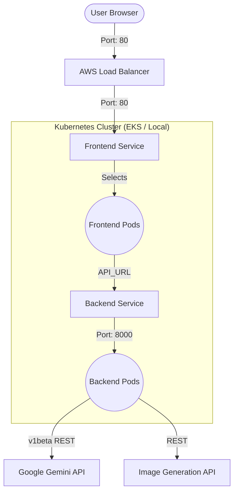

# 🎓 EduGen AI: High-Fidelity Multimodal Education Platform

[](https://kubernetes.io/)
[](https://aws.amazon.com/eks/)
[](https://fastapi.tiangolo.com/)
[](https://streamlit.io/)
[](https://ai.google.dev/)

**EduGen AI** is an institutional-grade, multimodal Generative AI platform designed to transform complex topics into structured, visually-rich educational "Concept Packs." By leveraging cutting-edge LLMs and specialized image generation, it tailors learning experiences for everyone from elementary students to professional researchers.

---

## ✨ Core Features

*   **⚡ Multimodal Learning Experience**: Combines deep narrative explanations with high-fidelity, text-free educational diagrams.
*   **🎯 Grade-Level Tailoring**: Dynamically adjusts vocabulary, complexity, and examples for **Elementary**, **High School**, **College**, and **Professional** audiences.
*   **🔠 Structured Knowledge**: Generates structured JSON output containing narratives, key concepts, flashcards, and summary points.
*   **🖼️ Visual Flashcards**: Integrates specialized Image Generation APIs to create complementary visuals for every major concept.
*   **🚀 Production-Ready Architecture**: Built for the cloud with specialized container optimization and multi-environment Kubernetes support.

---

## 🏗️ Technical Architecture

The platform architecture ensures scalability, high availability, and rapid performance through a decoupled frontend-backend system.



---

## 🛠️ Infrastructure & DevOps Excellence

### 🐳 Optimized Containerization
Initially, the application containers exceeded **9GB** due to heavy dependency overhead. We implemented strategic optimizations to reach a lightweight **1.16GB** footprint:
*   **CPU-Only PyTorch**: Stripped out 5GB+ of unnecessary CUDA/GPU libraries.
*   **Split Dependencies**: Separated frontend and backend requirements to reduce image bloat.
*   **Native API Adoption**: Switched to the native Gemini REST API to eliminate secondary library dependencies.

### ☸️ Kubernetes Orchestration
The application is ready for both local and cloud environments:
*   **Local (Kind/Docker Desktop)**: Optimized with `IfNotPresent` pull policies and `NodePort` mapping for rapid testing.
*   **Cloud (Amazon EKS)**: Deployed with managed `t3.micro` nodes, custom health probes, and `LoadBalancer` integration for production-grade availability.
*   **Zero-Downtime Updates**: Configured with `RollingUpdate` strategies to ensure continuous service during new releases.

---

## 🚀 Getting Started

### 1. Environment Configuration
Create a `.env` file in the root directory:
```ini
GEMINI_API_KEY=your_key
LLM_MODEL=gemini-3-flash-preview
LLM_BASE_URL=https://generativelanguage.googleapis.com/v1beta
IMAGE_API_KEY=your_key
IMAGE_MODEL=img4
IMAGE_BASE_URL=https://api.infip.pro/v1
LOG_LEVEL=INFO
```

### 2. Local Kubernetes Deployment (Docker Desktop)
```powershell
# 1. Switch to local context
kubectl config use-context docker-desktop

# 2. Apply Secrets and Manifests
kubectl apply -f k8s/secrets.yaml
kubectl apply -f k8s/

# 3. Access the app
kubectl port-forward service/frontend-service 8501:80
```
Open [http://localhost:8501](http://localhost:8501)

### 3. Cloud Deployment (AWS EKS)
```powershell
# Create the cluster
eksctl create cluster --name edugen-cluster --region eu-north-1 --node-type t3.micro --nodes 2

# Deploy
kubectl apply -f k8s/
```

---

## 📂 Project Structure
*   `backend/`: FastAPI application server and AI integration services.
*   `frontend/`: Streamlit interactive user interface.
*   `k8s/`: Kubernetes manifests for Deployments, Services, and Secrets.
*   `utils/`: Shared prompt engineering and utility functions.
*   `scripts/`: Automation scripts for deployment and environment setup.
*   `docs/`: High-level design documents and project reports.

---

Designed and built for **Project - II: Multimodal GenAI Education**. 🎓✨
