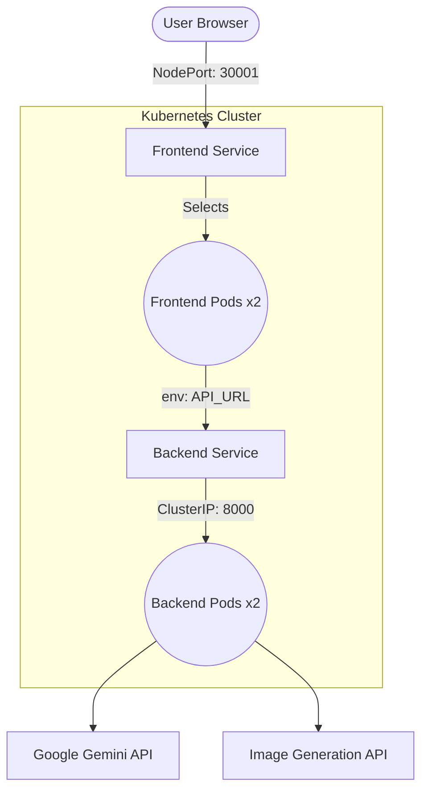

# EduGen AI (Multimodal GenAI Education)

EduGen AI is a production-ready, multimodal Generative AI application designed to transform any topic into a structured, highly visual "Concept Pack". By targeting specific grade levels, it tailors complex concepts into easy-to-understand narratives, visual flashcards, and structured data suitable for presentations.

## ✨ Features

- **Tailored Learning:** Generate content dynamically adapted to specific grade levels (Elementary, High School, College, Professional).
- **Multimodal Generation:**
  - **Text:** Comprehensive learning narratives and structured concept breakdowns using Google Gemini.
  - **Images:** High-fidelity visual flashcards and diagrams generated via an Image Generation API to complement the text.
- **Structured Concept Packs:** Outputs structured JSON containing narrative text, key concepts with images, detailed explanations, and summary points.
- **Modern User Interface:** A sleek, responsive, and dynamic frontend built with Streamlit, featuring a dark-themed UI, session history management, and polished aesthetics.
- **Optimized Performance:** In-memory caching for content and images to avoid repeated API calls and ensure fast response times.
- **Vector Search Ready:** Uses ChromaDB with SentenceTransformers embeddings for semantic search capabilities.

## 🏗️ Architecture

- **Frontend:** [Streamlit](https://streamlit.io/) for a highly interactive and aesthetically pleasing user interface.
- **Backend:** [FastAPI](https://fastapi.tiangolo.com/) providing robust REST APIs (`/generate-content`, `/generate-image`).
- **LLM Engine:** [Google Gemini](https://ai.google.dev/) for generating educational text and structuring data.
- **Image Engine:** Custom Image Generation API for generating educational visuals.

## 🧱 Digital Infrastructure & DevOps

The application is architected for scalability and high availability using a containerized multi-pod system.

### Architecture Diagram



## 🚀 Setup & Installation

### 1. Environment Setup

Create a virtual environment and install the required dependencies:

```bash
python -m venv .venv

# On Windows:
.venv\Scripts\activate
# On Linux/macOS:
# source .venv/bin/activate

pip install -r requirements.txt
```

### 2. Configure Environment Variables

Create a `.env` file in the root directory and add your API keys:

```ini
GEMINI_API_KEY=your_gemini_api_key_here
GEMINI_MODEL=gemini-1.5-flash
IMAGE_API_KEY=your_image_api_key_here
IMAGE_MODEL=provider-4/imagen-4
IMAGE_BASE_URL=https://api.a4f.co/v1
VECTOR_DB_PATH=./vector_store
LOG_LEVEL=INFO
```

### 3. Start the Backend Server

Run the FastAPI backend using `uvicorn`:

```bash
python -m uvicorn backend.main:app --host 127.0.0.1 --port 8000 --reload
```

The backend API will be available at `http://127.0.0.1:8000`. You can view the interactive API documentation at `http://127.0.0.1:8000/docs`.

### 4. Start the Frontend Application

In a new terminal, activate your virtual environment and run the Streamlit app:

```bash
streamlit run frontend/app.py
```

The application will open in your default web browser (typically at `http://localhost:8501`).

## 💡 Sample Prompts

Try these topics with different grade levels to see how the content adapts:

- _Explain Transformer architecture in NLP_ (College / Professional)
- _Photosynthesis_ (Elementary / High School)
- _Newton's Laws of Motion_ (High School)
- _The Water Cycle_ (Elementary)
- _Quantum Computing_ (College)

## 🐳 Dockerization

The project is split into two separate microservices:

1. **Backend (FastAPI):** `Dockerfile.backend`
2. **Frontend (Streamlit):** `Dockerfile.frontend`

To build images locally for Minikube:
```bash
# 1. Point terminal to Minikube's Docker daemon
eval $(minikube docker-env)

# 2. Build backend
docker build -t backend:latest -f Dockerfile.backend .

# 3. Build frontend
docker build -t frontend:latest -f Dockerfile.frontend .
```

## ☸️ Kubernetes Deployment (Minikube)

All manifests are located in the `/k8s` folder.

### Deployment Steps:
1. **Start Minikube:** `minikube start`
2. **Setup Secrets:**
   - Open `k8s/secrets.yaml`
   - Add your API keys (Base64 encoded)
   - Apply them: `kubectl apply -f k8s/secrets.yaml`
3. **Apply Other Manifests:** `kubectl apply -f k8s/`
4. **Verify Status:**
   - `kubectl get pods`
   - `kubectl get svc`
5. **Access Application:** `minikube service frontend-service`

## 🎥 How to Demo: Zero-Downtime Rolling Update

To demonstrate this for your project presentation, follow these steps in your terminal:

1. **Watch the Pods in real-time:**
   Open a side terminal and run:
   ```bash
   kubectl get pods -w
   ```

2. **Trigger an Update:**
   Update the image of the backend deployment (simulating a v1 to v2 update):
   ```bash
   kubectl set image deployment/backend-deployment backend=backend:latest
   ```

3. **Observe the Magic:**
   In your "Watch" terminal, you will see:
   - A new pod is **Created**.
   - The new pod waits for its **Readiness Probe** to pass.
   - Once ready, the old pod is **Terminated**.
   - This repeats until all 2 replicas are updated.

4. **Verify Zero Downtime:**
   Refresh your browser throughout this process. You will notice the application never goes offline.

### 🔄 Rolling Update Strategy
The system uses a `RollingUpdate` strategy configured with:
- `maxUnavailable: 1`: At least one pod is always online.
- `maxSurge: 1`: One extra pod is created during the transition.

## 🤖 CI/CD Pipeline
A GitHub Actions workflow is provided in `.github/workflows/deploy.yml` which automates:
- Dependency installation
- Docker image building
- Sanity checks

### Jenkins (Optional)
If you prefer Jenkins, use the provided `Jenkinsfile`. It defines a declarative pipeline that mirrors the Docker build and K8s deployment logic.

## ☁️ AWS Deployment (eu-north-1)

For production-like deployment on AWS EKS, follow these steps:

### 1. Prerequisites
- **AWS CLI** configured (`aws configure`)
- **Docker Desktop** running
- **eksctl** installed (`winget install weaveworks.eksctl`)

### 2. Automated Setup
We provide an automation script that handles ECR creation, image building, and manifest updates:

1. Open PowerShell as Administrator.
2. Run the script:
   ```powershell
   .\scripts\deploy_aws.ps1
   ```
3. Enter your **Gemini** and **Image** API keys when prompted.

### 3. Create EKS Cluster
Run this command to create your AWS cluster (Takes ~20 mins):
```bash
eksctl create cluster --name edugen-cluster --region eu-north-1 --nodegroup-name standard-nodes --nodes 2 --managed
```

### 4. Deploy
Once the cluster is ready, apply everything:
```bash
kubectl apply -f k8s/
```

### 5. Access on Mobile
Get the public AWS LoadBalancer URL:
```bash
kubectl get svc frontend-service
```
Copy the **EXTERNAL-IP** and open it in any mobile browser!


## 📝 Notes & Development

- The application uses custom CSS injection in Streamlit to achieve a premium, dark-mode visual experience reminiscent of high-end AI tools.
- Generated images and content are cached to optimize API usage and latency.
- Make sure you have valid API keys from Google and your Image API provider for full functionality.
